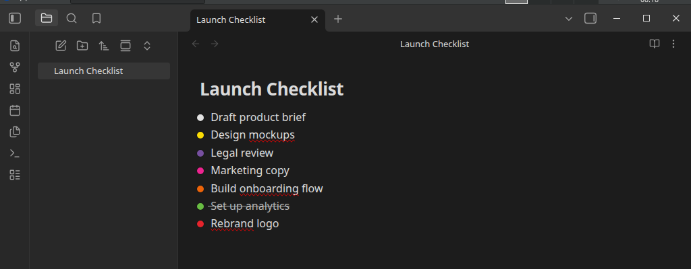

# Checklist Status Sets

📖 **[Full documentation](https://danrfletcher.github.io/obsidian-checklist-status-icons/)**

A companion plugin to [Status Sets](https://github.com/danrfletcher/obsidian-file-folder-status-icons) —
applies the same reusable status sets to checklist items **inside your
notes**, not just the file tree.



## Requires Status Sets

This plugin reads status sets you define in
[Status Sets](https://github.com/danrfletcher/obsidian-file-folder-status-icons)
(`file-folder-status-icons`) — install and enable that first. Status sets
themselves are never created, edited, or duplicated here; this plugin only
reads them, live, via a small public API Status Sets exposes for this
purpose.

## Features

- **Three assignment scopes**: an entire file, a specific block (with
  optional inherit-to-subtasks), or everything under a heading.
- **Traffic-light status icons** replace the native checkbox glyph entirely,
  styled identically to Status Sets' file-tree dots — Glow included, if you
  have that on.
- **Left-click cycles** a task to the next status; **right-click** opens the
  full manual picker — Status Sets' own popup, reused as-is.
- **Hide completed** actually removes completed-status tasks from the
  rendered note, not just visually.
- Works in both **Live Preview** and **Reading view**.
- **Nothing is written to frontmatter.** A task's status is a single
  character inside its own checkbox brackets (`- [ ]` → `- [I]`, etc.),
  chosen after testing live that this is the only format Obsidian's own
  task parser actually recognizes as a task — see the
  [docs](https://danrfletcher.github.io/obsidian-checklist-status-icons/reference/markdown-marker/)
  for why, and the tradeoffs involved.

## Usage

1. Define a status set in Status Sets first (Settings → Status Sets → New
   status set), if you haven't already.
2. Settings → Checklist Status Sets → **Assign a file or block** → type a
   note's path, pick a status set, **Assign**.
3. Open the note. Left-click a task's dot to cycle status; right-click for
   the full picker.
4. For finer control, extend the path with `^` (pick a block) or `#` (pick a
   heading) instead of assigning the whole file.

## Installation

### From Obsidian

Settings → Community plugins → Browse → search "Checklist Status Sets" →
Install → Enable.

### Manually

Copy `main.js`, `manifest.json`, and `styles.css` from a
[release](https://github.com/danrfletcher/obsidian-checklist-status-icons/releases)
into `<your-vault>/.obsidian/plugins/checklist-status-icons/`, then enable
the plugin from Community plugins.

## Development

```bash
npm install
npm run dev     # watch build
npm run build   # typecheck + production build
npm run lint
```

## Support

- 🐛 [Report a bug](https://github.com/danrfletcher/obsidian-checklist-status-icons/issues/new?template=bug_report.yml&labels=bug)
- 💡 [Request a feature](https://github.com/danrfletcher/obsidian-checklist-status-icons/discussions/new?category=ideas)
- ☕ [Buy me a coffee](https://buymeacoffee.com/danrfletcher)

## License

MIT
