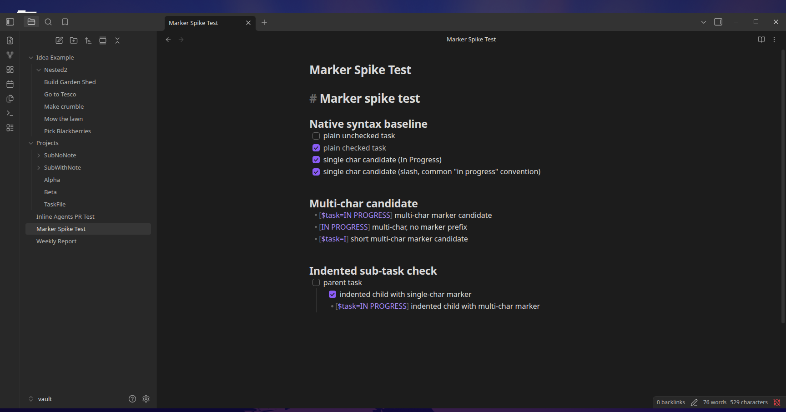
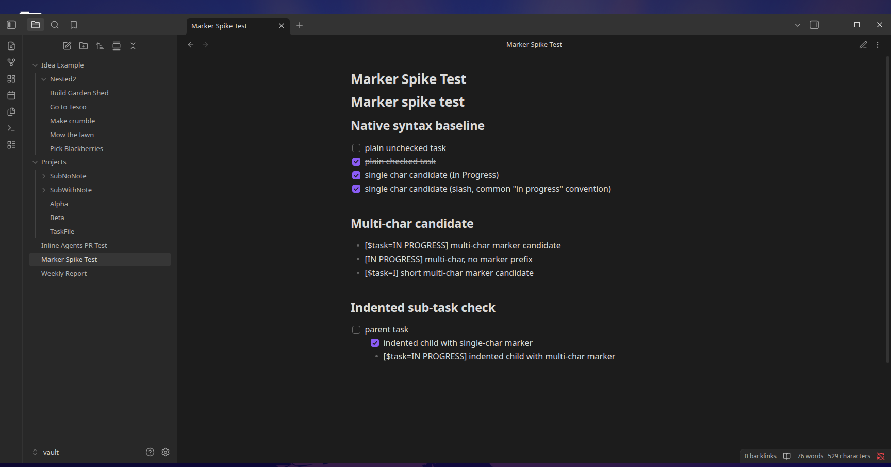

# Markdown Status Marker

A task's current status is encoded directly in its markdown: the character
between the brackets in `- [ ]`.

- **Default status** is always a plain space — `- [ ]` — regardless of what
  the default status is actually named.
- **Every other status** gets a single character, assigned automatically the
  first time you set a task to that status (e.g. "In Progress" → `- [I]`).
  You never choose or manage these characters yourself.

## Why a single character, not a readable name

The obvious-looking alternative — something like `- [$task=IN PROGRESS]` —
was tested live before committing to either approach. The result:

=== "Live Preview"
    

=== "Reading view"
    

A single character (`- [I]`) is recognized by Obsidian's own task parser as
a real, interactive task in both views. Multi-character content
(`- [$task=IN PROGRESS]`) is **not** recognized as a task at all — it
renders as a plain bullet with the literal bracket text visible. That rules
out the readable-name approach outright: it isn't "a task with unusual
text," it simply isn't a task, so none of Obsidian's own task behavior
(click-to-toggle, task queries, compatibility with other task plugins)
works on those lines.

## Stability

The character-to-status mapping is keyed by the status's internal id, not
its name — so **renaming a status in Status Sets does not reassign or
break its character**. Reordering statuses, or adding/removing others,
doesn't shift it either. It's assigned once and stays put.

## The tradeoff: this data doesn't travel with the note

Because the character-to-status mapping lives in this plugin's own local
data (not in the note, and not in Status Sets' data), a written marker only
means the same thing inside *this vault, with this plugin's data intact*.

- **Renaming a status is safe** — existing `- [I]` tasks keep meaning
  whatever status `I` is mapped to, because the mapping follows the status's
  id, not its name.
- **Copying a note into a different vault**, or resetting this plugin's own
  data, is not — a character written in one vault has no guaranteed meaning
  in another, since the mapping is assigned independently per vault. Think
  of it the way you'd think about a tag or wikilink: portable as text, but
  only meaningful in the vault that defines what it points to.

## Matching rule

The marker must be the first thing on the line, aside from leading
whitespace/indentation — same as Obsidian's own task syntax.
